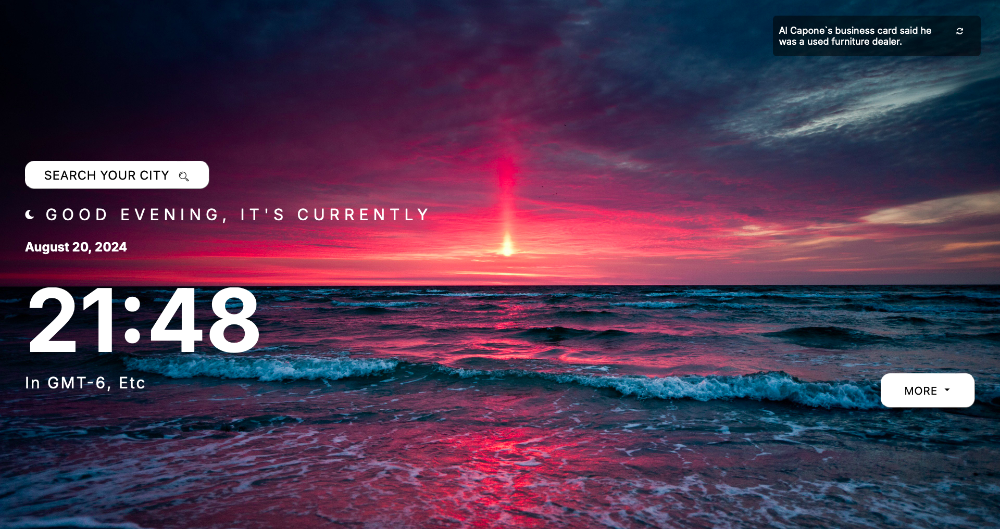
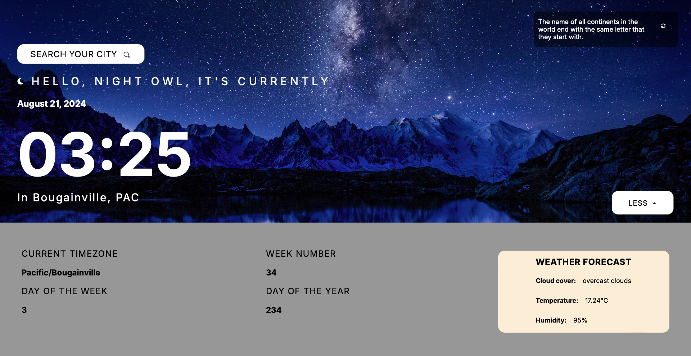

Project : "Watch App"

Installation:
1. npm install
2. npm start

Technologies : react, node, js, scss

Screenshots:

Description:
The application combines a watch and a weather forecast. We can choose any capital city in the world to check the time and weather in a given place. Random facts from many fields make our time more pleasant.

API :
1. openweathermap
2. worldtimeapi
3. uselessfacts
